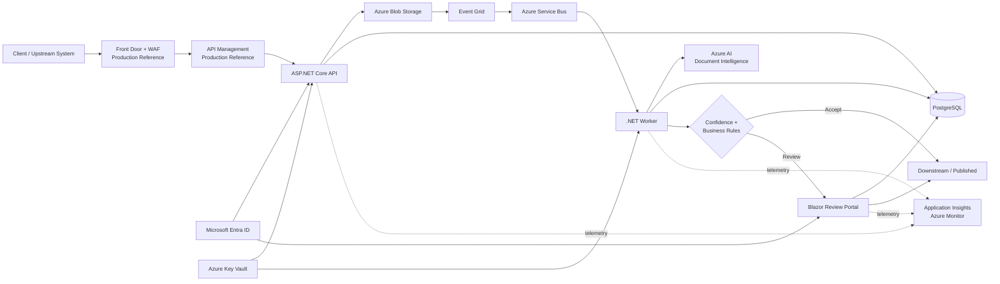

# IntelliDocs AI

> Production-oriented Azure/.NET document intelligence platform for secure ingestion, AI-assisted extraction, deterministic confidence routing, auditable human review, and resilient asynchronous processing.

**Status:** P0-P12 complete | Portfolio-ready reference implementation

IntelliDocs AI processes enterprise documents such as invoices, purchase orders, delivery notes, contracts, forms, and scans. It combines Azure AI Document Intelligence with deterministic validation, durable messaging, PostgreSQL workflow state, human review, identity-based access, infrastructure as code, and operational telemetry.

## At a Glance

| Area | Implementation |
| --- | --- |
| Backend | ASP.NET Core / .NET |
| AI | Azure AI Document Intelligence |
| Messaging | Azure Service Bus |
| State | PostgreSQL |
| Document storage | Azure Blob Storage |
| Human review | Blazor review portal |
| Identity | Microsoft Entra ID + Managed Identity |
| Secrets | Azure Key Vault |
| Infrastructure | Terraform + Azure Container Apps |
| Observability | OpenTelemetry + Application Insights + Azure Monitor |
| Verification | 65/65 .NET tests + 21/21 Python evaluation tests |

## Problem

Enterprise document processing is more than OCR. A production workflow must determine what a document is, extract useful structure, validate uncertain output, survive transient failures, prevent silent loss of work, protect sensitive content, and provide a controlled fallback when automation is not trustworthy.

IntelliDocs AI targets German/European enterprise documents including invoices, purchase orders, delivery notes, contracts, forms, and scans.

## Solution

The platform accepts documents through an ASP.NET Core API, stores originals in Azure Blob Storage, persists authoritative workflow state in PostgreSQL, and processes work asynchronously through Azure Service Bus.

Azure AI Document Intelligence performs classification and extraction. Deterministic confidence and business-validation rules then decide whether processing can continue automatically or requires human review.

The design principle is simple:

> AI proposes; deterministic policy evaluates; humans resolve uncertainty; the system records the decision.

## Architecture

### System Architecture



### Processing Flow

1. A client submits a document to the ASP.NET Core ingestion API.
2. The API stores the original in Blob Storage and persists document state in PostgreSQL.
3. Event Grid signals storage/change events.
4. Service Bus owns durable processing, retry, settlement, concurrency, and dead-letter semantics.
5. A .NET worker consumes the message under bounded concurrency.
6. Azure AI Document Intelligence performs classification and extraction.
7. Deterministic policy evaluates confidence and business validation.
8. Acceptable documents continue automatically.
9. Uncertain or invalid documents are routed to human review.
10. Retry, dead-letter, and re-drive paths recover failed work.

### Key Design Decisions

| Decision | Rationale |
| --- | --- |
| Event Grid signals change; Service Bus owns work semantics | Separates notification from durable processing, retry, settlement, concurrency, and DLQ behavior |
| PostgreSQL owns authoritative workflow state | State remains queryable and auditable independently of transient message delivery |
| Blob Storage keeps original documents | Separates binary storage from transactional workflow metadata |
| AI output passes through deterministic policy | Model confidence alone is not treated as a business decision |
| Human review is explicit | Uncertain automation becomes controlled work rather than silent failure |
| Managed identity is preferred | Reduces long-lived Azure credentials |
| Terraform defines Azure topology | Infrastructure and security assumptions are repeatable and reviewable |
| OpenTelemetry provides shared instrumentation | API, worker, and portal expose consistent operational signals |

## Engineering Highlights

- Explicit document-processing state transitions in PostgreSQL.
- Azure Service Bus PeekLock processing with explicit message settlement.
- Bounded worker concurrency.
- Retry, dead-letter queue, and controlled re-drive.
- Generation-aware message identity for reprocessed work.
- Azure AI Document Intelligence classification and extraction.
- Deterministic confidence policy with a `0.90` acceptance threshold.
- Business validation in addition to model confidence.
- Auditable human review and correction workflow.
- Microsoft Entra ID authentication and authorization.
- Managed identities and Azure RBAC.
- Azure Key Vault integration.
- Private-reference networking with Private Endpoints and Private DNS.
- OpenTelemetry metrics and traces.
- Application Insights / Azure Monitor workbook definitions.
- Terraform infrastructure validation.
- Automated .NET and Python verification.

## Quality & Test Results

| Check | Result |
| --- | ---: |
| .NET tests | **65/65 passed** |
| Python evaluation tests | **21/21 passed** |
| Terraform `fmt -check` | **PASS** |
| Terraform `validate` | **PASS** |
| Git diff check | **PASS** |
| API health regression | **HTTP 200** |
| Local reliability probe | **520/520 successful** |
| Local reliability failures | **0** |

### Local Reliability Probe

| Requests | Concurrency | Success | Elapsed | Requests/sec | P50 | P95 | P99 |
| ---: | ---: | ---: | ---: | ---: | ---: | ---: | ---: |
| 20 | 2 | 20/20 | 0.83 s | 24.07 | 2.11 ms | 84.11 ms | 88.66 ms |
| 500 | 20 | 500/500 | 45.79 s | 10.92 | 3.77 ms | 26.40 ms | 662.57 ms |

Across both runs, **520/520 requests succeeded with zero failures**.

> This is a local bounded-concurrency reliability/performance probe, **not a production capacity benchmark**. PowerShell `Start-Job` overhead, local machine scheduling, and the lightweight health endpoint affect throughput and tail latency.

## AI & Document Processing

### Supported Scope

The target domain is German/European enterprise document processing, including:

- invoices;
- purchase orders;
- delivery notes;
- contracts;
- forms;
- scanned business documents.

Azure AI Document Intelligence provides the AI classification/extraction capability. The surrounding application owns orchestration, state, policy, validation, review, reliability, and observability.

### Confidence & Validation

AI confidence is one signal, not proof that extracted data is correct.

The deterministic acceptance threshold demonstrated by this project is:

```text
0.90
```

The routing model is:

```text
AI prediction
     |
     v
Confidence + deterministic validation
     |
     +---- acceptable ----> automated path
     |
     +---- uncertain -----> human review
```

The `0.90` threshold is an application policy value demonstrated by the project. It is not claimed to be a universal optimal threshold for every document population.

### Human-in-the-Loop

The Blazor review portal provides a controlled fallback for uncertain or invalid automation. Reviewers can inspect AI-assisted results, correct extracted information, and record an auditable decision.

Reviewer identity is derived from the authenticated Entra principal rather than accepted as arbitrary request data.

Review corrections and decisions are also useful quality signals for future analysis.

### AI/ML Non-Goals

IntelliDocs AI does not claim:

- fully autonomous document approval;
- perfect OCR or extraction;
- zero-review operation;
- autonomous model retraining;
- production accuracy across every document type or language;
- that model confidence equals calibrated business correctness;
- that the local reliability probe represents Azure production capacity.

### Model Versioning & MLOps

The implementation emphasizes traceability around AI-assisted decisions, confidence, validation outcomes, review corrections, and processing evidence.

Automated retraining and automated production model promotion are intentionally outside the current scope.

Production extensions could add:

- explicit model/deployment version metadata per processed document;
- versioned evaluation datasets;
- promotion gates based on regression results;
- shadow or canary evaluation;
- drift monitoring;
- rollback to a previously approved model/deployment;
- controlled confidence-threshold changes.

## Reliability

### State & Failure Model

A representative processing path is:

```text
Queued
  |
  v
Processing
  |
  +--> transient failure --> retry
  |
  +--> repeated failure --> DeadLettered
                              |
                              v
                           re-drive
                              |
                              v
                            Queued
                              |
                              v
                          Processing
                              |
                              v
                           Extracted
```

Service Bus uses:

- PeekLock;
- explicit settlement;
- retry behavior;
- bounded worker concurrency;
- dead-letter handling.

The demonstrated dead-letter path uses a maximum delivery count of **5**.

### Retry / DLQ / Re-drive

Re-drive is more than copying a DLQ message back to the queue.

The workflow:

1. Loads authoritative PostgreSQL state.
2. Matches the dead-lettered work.
3. Validates tenant context.
4. Increments the processing generation.
5. Transitions database state from `DeadLettered` to `Queued`.
6. Publishes a replacement message.
7. Completes the original dead-letter message only after replacement publication succeeds.

Generation-specific message identity helps distinguish the replacement attempt from the original processing attempt.

Evidence:

- [`docs/evidence/p5/failure-demo.md`](docs/evidence/p5/failure-demo.md)
- [`docs/evidence/p12/failure-recovery.md`](docs/evidence/p12/failure-recovery.md)

## Security & Privacy

### Authentication & Authorization

The production-reference identity model uses Microsoft Entra ID.

- The API uses Entra authentication through Microsoft.Identity.Web.
- The review portal uses Entra OpenID Connect.
- The portal acquires downstream API tokens.
- Reviewer identity comes from the authenticated principal.
- Azure-hosted workloads prefer managed identity for supported Azure services.

### Managed Identity & Secrets

Azure Key Vault is part of the reference architecture for secret material that cannot be eliminated through identity-based access.

The review portal architecture includes a user-assigned managed identity and federated identity credential approach rather than introducing an application client secret.

### Private Networking

The production-reference Terraform topology includes:

- VNet: `10.40.0.0/16`
- Container Apps subnet: `10.40.0.0/23`
- Private Endpoint subnet: `10.40.2.0/24`
- Private Endpoint for Blob Storage
- Private Endpoint for Service Bus
- Private Endpoint for Key Vault
- Private Endpoint for Azure AI Document Intelligence
- Private Endpoint for PostgreSQL

Private DNS zones include:

- `privatelink.blob.core.windows.net`
- `privatelink.servicebus.windows.net`
- `privatelink.vaultcore.azure.net`
- `privatelink.cognitiveservices.azure.com`
- `privatelink.postgres.database.azure.com`

Backend public access is disabled where supported in the target Terraform design.

Service Bus Premium is required by the Private Link design. It is therefore a production-reference choice rather than the default recommendation for a low-cost portfolio deployment.

### Telemetry Privacy

Custom telemetry uses bounded, low-cardinality tags.

Metric dimensions deliberately avoid:

- document IDs;
- reviewer IDs;
- filenames;
- extracted document values;
- exception messages.

This reduces privacy exposure and uncontrolled telemetry-cardinality growth.

## Observability & SLO Readiness

API, worker, and review components share OpenTelemetry instrumentation.

Representative metrics include:

- `intellidocs.documents.processed`
- `intellidocs.document.processing.duration`
- `intellidocs.ai.classification.confidence`
- `intellidocs.ai.policy.confidence`
- `intellidocs.routing.decisions`
- `intellidocs.validation.issues`
- `intellidocs.review.corrections`
- `intellidocs.review.decisions`
- `intellidocs.processing.retries`
- `intellidocs.processing.deadletters`
- `intellidocs.ai.document_intelligence.operations`

The Azure reference architecture includes workspace-based Application Insights and an Azure Monitor workbook for operations, AI quality, review behavior, and cost-related signals.

These signals make the platform **SLO-ready**, but the repository does **not** claim production SLO attainment.

A production deployment could establish objectives for:

- ingestion availability;
- end-to-end processing latency;
- successful processing rate;
- retry and dead-letter rate;
- review backlog age;
- automated acceptance rate;
- correction rate.

Those objectives should be baselined against representative deployed traffic before operational commitments are defined.

## Run Locally

### Prerequisites

The local workflow expects:

- .NET SDK;
- Docker / Docker Compose;
- PostgreSQL-compatible local dependencies defined by the repository;
- Python and evaluation-test dependencies;
- Terraform for infrastructure validation.

Azure credentials are required only for workflows that actually call deployed Azure resources.

### Start Dependencies

```powershell
docker compose up -d
```

### Run the API

```powershell
$env:ASPNETCORE_ENVIRONMENT = "Development"
$env:ASPNETCORE_URLS = "http://127.0.0.1:5000"

dotnet run `
    --project ".\src\IntelliDocs.Api\IntelliDocs.Api.csproj" `
    --no-launch-profile
```

### Health Check

```powershell
Invoke-WebRequest `
    -Uri "http://127.0.0.1:5000/health" `
    -UseBasicParsing
```

Expected result:

```text
HTTP 200
```

The health endpoint is intentionally available before authentication middleware so infrastructure health probing does not depend on Entra configuration. Protected application endpoints remain authenticated.

### Run Verification

```powershell
.\scripts\p12\verify.ps1
```

Additional P12 scripts:

```text
scripts/p12/load-test.ps1
scripts/p12/quality-regression.ps1
scripts/p12/verify.ps1
```

## Azure Deployment

### Production-Reference Architecture

Terraform defines the Azure-oriented target architecture across identity, storage, messaging, compute, networking, secrets, monitoring, and AI integration.

The production-reference topology is intentionally stronger - and more expensive - than what is necessary for a portfolio demonstration.

### Low-Cost Demo

Do **not** apply the entire production-reference topology solely to prove that every Azure resource can exist simultaneously.

A lower-cost demonstration can focus on:

1. API and worker behavior.
2. PostgreSQL workflow state.
3. Blob-based document storage.
4. Azure AI Document Intelligence integration.
5. Service Bus processing where messaging evidence is required.
6. Local review and verification workflows.
7. Terraform validation for expensive production-reference controls.

Evaluate cost before provisioning Service Bus Premium and the complete Private Endpoint topology.

### CI/CD

The repository targets GitHub Actions with Azure OIDC/federated authentication rather than long-lived Azure credentials stored as CI secrets.

A production pipeline can separate:

```text
build
  -> automated tests
  -> quality regression
  -> Terraform validation
  -> artifact/container publication
  -> environment-specific plan
  -> controlled deployment
  -> post-deployment verification
```

Infrastructure changes should be reviewed through Terraform plans before apply.

### Deployment Validation Boundary

P3/P4 include live Azure infrastructure and Azure AI Document Intelligence evidence.

P9/P10/P11 were validated primarily through implementation, automated tests, Terraform formatting/validation, and repository evidence rather than a final full production-topology apply.

The following remain environment-specific deployment-validation activities:

- final Entra federation and consent;
- managed-identity bootstrap behavior;
- Key Vault runtime secret resolution;
- live Private Endpoint routing;
- Private DNS resolution;
- live Application Insights ingestion;
- Azure Monitor workbook rendering with deployed telemetry;
- final Azure cost behavior;
- production-scale capacity testing.

This boundary is deliberate: static/IaC validation is not presented as equivalent to production operation.

## Demo Walkthrough

1. Start with the architecture diagram and explain why Event Grid and Service Bus have different responsibilities.
2. Show the ingestion API and PostgreSQL state machine.
3. Demonstrate Azure AI Document Intelligence integration.
4. Show classification/extraction output passing through deterministic confidence and validation policy.
5. Demonstrate the human-review fallback for uncertain results.
6. Explain retry, DLQ, and safe re-drive using the recorded failure evidence.
7. Show Entra, managed identity, Key Vault, and private-networking Terraform.
8. Show OpenTelemetry signals and the Azure Monitor workbook definition.
9. Run or present the final automated verification.
10. Close with the deployment boundary: what was live-validated, what is production-reference IaC, and what remains environment-specific validation.

Detailed runbook:

[`docs/evidence/p12/demo-runbook.md`](docs/evidence/p12/demo-runbook.md)

## Design Trade-offs & Production Improvements

| Current choice | Trade-off / production extension |
| --- | --- |
| `0.90` confidence threshold | Clear and testable; calibrate per field/document class against representative labeled data |
| Human review | Improves control but adds operational latency/cost; add prioritized queues and reviewer-capacity SLOs |
| PostgreSQL authoritative state | Strong audit/query model; extend with outbox/inbox patterns for stronger message/database coordination |
| Service Bus durable queue | Strong retry/DLQ semantics; tune concurrency, locks, sessions/partitioning using representative workloads |
| Service Bus Premium | Supports Private Link but materially increases demo cost |
| Private Endpoints | Improve isolation while increasing DNS/network complexity |
| Local P12 load probe | Cheap and reproducible; use distributed deployed-environment testing for production capacity work |
| AI-assisted extraction | Probabilistic; expand labeled evaluation sets, drift monitoring, and version gates |
| Terraform reference topology | Repeatable, but static validation is not runtime proof; add environment apply and post-deployment tests |

## Evidence

Detailed implementation and validation evidence is retained under `docs/evidence/`.

| Capability | Evidence |
| --- | --- |
| Azure AI Document Intelligence | [`docs/evidence/p4/`](docs/evidence/p4/) |
| Retry / DLQ / failure demonstration | [`docs/evidence/p5/failure-demo.md`](docs/evidence/p5/failure-demo.md) |
| Identity / managed access | [`docs/evidence/p9/identity.md`](docs/evidence/p9/identity.md) |
| Private-reference networking | [`docs/evidence/p10/network.md`](docs/evidence/p10/network.md) |
| Observability / quality / cost telemetry | [`docs/evidence/p11/observability.md`](docs/evidence/p11/observability.md) |
| Local reliability probe | [`docs/evidence/p12/load-test.md`](docs/evidence/p12/load-test.md) |
| Failure recovery | [`docs/evidence/p12/failure-recovery.md`](docs/evidence/p12/failure-recovery.md) |
| Quality regression | [`docs/evidence/p12/quality-regression.md`](docs/evidence/p12/quality-regression.md) |
| Demo runbook | [`docs/evidence/p12/demo-runbook.md`](docs/evidence/p12/demo-runbook.md) |

## Resource Cleanup

### Local

Stop local containers when no longer required:

```powershell
docker compose down
```

Use volume removal only when intentionally deleting persisted local development data.

### Azure

Before destroying Azure infrastructure, inspect the destruction plan:

```powershell
terraform plan -destroy
```

Review the plan carefully before any destructive operation.

Remove temporary demo resources promptly to control cost, especially premium messaging and private-networking resources. Do not destroy shared or production resources merely because they appear in project Terraform.

## Project Status

**P0-P12 complete.**

Final verification recorded:

- **65/65** .NET tests passed;
- **21/21** Python evaluation tests passed;
- Terraform formatting and validation passed;
- API health regression returned **HTTP 200**;
- **520/520** requests succeeded in the local P12 reliability probe;
- retry, dead-letter, and re-drive behavior is documented with evidence.

The repository is a **production-oriented reference implementation with explicit evidence boundaries**, not a claim that every production-reference Azure component has undergone full live production validation.

P3/P4 include live Azure infrastructure and Document Intelligence evidence. P9/P10/P11 primarily demonstrate implementation, automated validation, Terraform correctness, and documented architecture.

Live private networking, final Entra federation/consent, deployed monitoring behavior, production-scale capacity, and final Azure cost characteristics remain environment-specific deployment-validation work.
