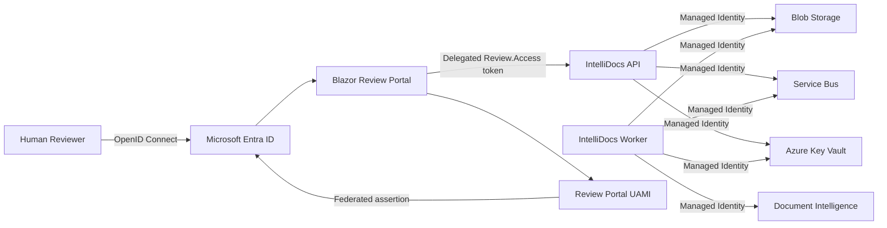

# P9 — Identity and Secretless Authentication Evidence

## Objective

P9 adds Microsoft Entra authentication, managed identities, Azure Key Vault integration, workload identity federation, and least-privilege Azure RBAC.

Exit criterion:

> No application client secret is required by IntelliDocs workloads.

## Identity diagram

## Human authentication

The Review Portal uses Microsoft.Identity.Web and OpenID Connect.

Review pages require authorization. The API validates Microsoft Entra bearer tokens.

Reviewer identity is not accepted from review mutation request bodies. The API derives the reviewer from the authenticated principal, preferring the Entra `oid` claim.

## API authorization

The IntelliDocs API exposes the delegated permission:

`Review.Access`

The Review Portal requests:

`api://<api-client-id>/Review.Access`

The portal sends the resulting access token to the API as a Bearer token.

## Secretless application credential

The Review Portal production confidential-client credential does not use an Entra application client secret.

Terraform provisions a user-assigned managed identity and federated identity credential for the portal application.

The federation audience is:

`api://AzureADTokenExchange`

Microsoft.Identity.Web uses `SignedAssertionFromManagedIdentity`.

No `azuread_application_password` resource is provisioned.

## Azure workload identity

The API and Worker use `DefaultAzureCredential`.

Terraform assigns least-privilege Azure data-plane permissions to their managed identities.

Document Intelligence local authentication is disabled in the Terraform-managed configuration.

## Key Vault

Azure Key Vault uses Azure RBAC authorization.

The API and Worker Container Apps reference the PostgreSQL application connection string through a Key Vault secret reference.

Terraform does not provision the PostgreSQL secret value. The secret must be supplied through an authorized deployment/bootstrap process.

## RBAC matrix

| Principal                     | Resource              | Access                           |
| ----------------------------- | --------------------- | -------------------------------- |
| API managed identity          | Blob Storage          | Storage Blob Data Contributor    |
| API managed identity          | Service Bus           | Azure Service Bus Data Sender    |
| API managed identity          | Key Vault             | Key Vault Secrets User           |
| Worker managed identity       | Blob Storage          | Storage Blob Data Contributor    |
| Worker managed identity       | Service Bus           | Azure Service Bus Data Receiver  |
| Worker managed identity       | Document Intelligence | Cognitive Services User          |
| Worker managed identity       | Key Vault             | Key Vault Secrets User           |
| Review Portal credential UAMI | Microsoft Entra       | Federated application credential |

## Credential inventory

| Credential                      | Production mechanism             |
| ------------------------------- | -------------------------------- |
| Human reviewer authentication   | Microsoft Entra / OpenID Connect |
| Portal to API                   | Delegated OAuth access token     |
| Portal application credential   | Federated managed identity       |
| API to Blob Storage             | Managed identity                 |
| API to Service Bus              | Managed identity                 |
| Worker to Blob Storage          | Managed identity                 |
| Worker to Service Bus           | Managed identity                 |
| Worker to Document Intelligence | Managed identity                 |
| PostgreSQL connection string    | Azure Key Vault secret reference |
| Entra application client secret | Not used                         |

## Validation boundary

Terraform validation proves that the infrastructure configuration is structurally valid for the pinned providers.

Application builds and automated authentication tests validate the application-side integration.

A live Azure deployment is a separate deployment-validation step. Until the infrastructure is applied, live Entra consent, federated token exchange, Container Apps identity bootstrap, and Key Vault secret resolution must not be represented as runtime-proven.

## P9 exit criterion

P9 satisfies the repository and architecture requirement that IntelliDocs application workloads do not depend on an Entra application client secret.

**No application client secret: PASS.**
